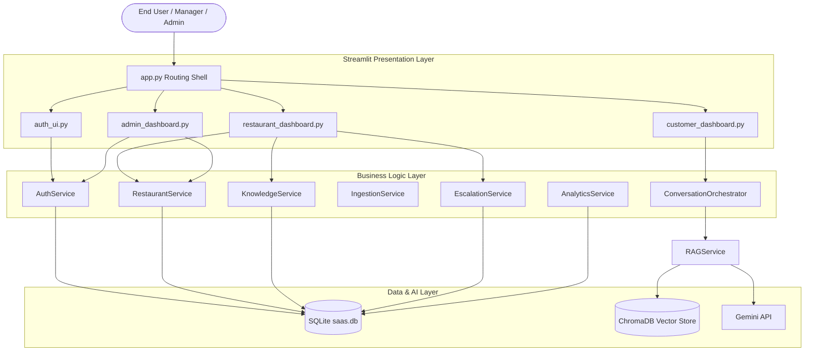

# Intelligent Customer Support Assistant (ICSA)

[](#)
[](#)
[](#)
[](#)
[](#)

The **Intelligent Customer Support Assistant (ICSA)** is an AI-powered, multi-tenant SaaS customer support platform designed for multi-restaurant food ordering systems. ICSA provides automated, context-aware chatbot support utilizing Retrieval-Augmented Generation (RAG), intent classification, sentiment analysis, and multi-language translation. 

---

## 1. Project Overview

ICSA acts as a dynamic customer service layer for food delivery networks. It provides customers with immediate, grounded answers based on restaurant-specific menus, business hours, and operational policies, while offering managers a consolidated portal to handle profile details, ingest knowledge documents, and manage customer tickets that escalate to manual review.

The system is architected around:
*   **Multi-Tenant SaaS Boundary:** Strict isolation of data records in SQLite and isolated collection spaces in ChromaDB prevent data leakage between restaurants.
*   **Owner-Only Public Onboarding:** The public registration endpoint creates a brand-new restaurant entity and designates the registering manager as the sole owner.
*   **Retrieval-Augmented Generation (RAG):** Integrates Google Gemini API with local semantic chunk index stores.
*   **Automated Review & Sentiment Escalation:** Identifies negative customer comments, logs priority levels, and maps them to a manager-controlled Review Center.

---

## 2. RC-1 Status

This repository contains the completed **Release Candidate 1 (RC-1)** milestone implementation of the ICSA platform.
*   **Steps 1–10:** Fully implemented, verified, and regression tested.
*   **Step 11 & 13:** Partially implemented (Analytics service integration and System Administrator console UI).
*   **Remaining Roadmap (Steps 12, 14–19):** Fully designed and scheduled for upcoming development phases.

---

## 3. Implemented Features

### 🔐 Authentication & Security
*   **Role-Based Access Control (RBAC):** Restricts interface views and API calls based on user roles (`admin`, `restaurant`, `customer`).
*   **Secure Password Hashing:** Uses `bcrypt` for user credentials storage.
*   **JWT Token Handlers:** Encrypts identity payloads and manages session state.

### 🏢 Multi-Tenant SaaS Engine
*   **Owner-Only Onboarding:** Enforces creating a new restaurant during public registration. Joining existing restaurants is restricted on both the frontend and backend.
*   **Logical Data Separation:** All queries partition data filtering on the tenant’s unique `restaurant_id`.
*   **Vector Collection Isolation:** Tenant documents are indexed in isolated semantic scopes.

### 📚 Knowledge Ingest & Parser Engine
*   **Multi-Format Processing:** Custom loaders ingest and clean **PDF**, **DOCX**, **CSV**, and **TXT** files.
*   **Recursive Splitter:** Chunks content into semantic fragments.
*   **Document Listing:** A manager dashboard displaying ingested files and processing states.

### 🧠 Unified AI Pipeline
*   **Semantic RAG Orchestration:** Combines chunk retrieval with prompt construction sent to the Google Gemini model.
*   **Intent Classification:** Categorizes inquiries (e.g., greetings, info, orders, human help).
*   **Sentiment Tracking:** Evaluates client feedback (Positive, Neutral, Negative) to trigger ticket creation.
*   **Language Recognition:** Translates inbound content and identifies locale flags.

### 💬 Customer Portal
*   **Interactive Chat Interface:** Displays historical messages and runs chat trees.
*   **Collapsible Citations:** Under assistant responses, expanders render the title, type, ID, and text snippet of the source documents.
*   **CSAT Rating Modal:** Gathers customer ratings (1–5 stars) and qualitative feedback comments.

### 📊 Management Portals
*   **Restaurant Owner Dashboard:** Displays profile edits, hours configurations, knowledge upload lists, and a Review Center to claim and resolve escalations.
*   **Platform Administrator Console:** Supervisory window showing users, active restaurants, and global system switches.

---

## 4. Current Architecture

The clean-architecture boundaries and data-routing mechanisms are shown below:



---

## 5. Technology Stack

| Layer | Technology / Package | Purpose |
| :--- | :--- | :--- |
| **Frontend** | Streamlit + Vanilla CSS | Interface views, reactive panels, and layouts |
| **Backend** | Python 3.12 | Core business logic and service architectures |
| **Database** | SQLite 3 | Relational entity storage and metadata tracking |
| **Vector DB** | ChromaDB | Vector embedding index partitioning |
| **AI LLM** | Google Gemini (generative-ai) | Conversational generation and grounding |
| **ORM** | SQLAlchemy (v2.0+) | Database queries mapping and relationships |
| **Auth** | PyJWT + bcrypt | Token creation, validation, and password safety |
| **Parsers** | pypdf + python-docx | Ingest loaders for document formats |
| **Testing** | Playwright + Python unittest | Integration checks and browser screenshots |

---

## 6. Repository Structure

```directory
.
├── backend/
│   ├── classifiers/      # Intent, Sentiment, and Language detectors
│   ├── database/         # SQLite tables connection setup and migrations
│   ├── models/           # SQLAlchemy model declarations (User, Restaurant, etc.)
│   ├── rag/              # Document splitters, loaders, and RAG orchestrator
│   ├── repositories/     # Database queries wrapping layer
│   └── services/         # Business logic services (Auth, Knowledge, Escalation)
├── data/
│   └── saas.db           # SQLite database local file
├── frontend/
│   ├── components/       # Interface screens (Admin, Customer, Restaurant Owner)
│   ├── styles.css        # Vanilla CSS style overrides
│   └── app.py            # Streamlit router entrypoint
├── screenshots/          # UAT execution screenshots
├── tests/                # System validation integration scripts
└── run_all_tests.py      # Master regression test harness
```

---

## 7. Implemented Blueprint Progress

The implementation progress follows the project development roadmap:

| Step | Blueprint Phase Title | Status |
| :---: | :--- | :---: |
| **1** | SaaS Foundation (Auth & Login/Logout UI) | ✅ |
| **2** | Tenant Registration & User Onboarding (Hardened) | ✅ |
| **3** | Restaurant Owner Profile (Settings & Hours) | ✅ |
| **4** | Knowledge Ingestion Engine (Multi-Format Support) | ✅ |
| **5** | Semantic Retrieval & Vector Index Store | ✅ |
| **6** | Multi-Tenant Partitioning Access Controls | ✅ |
| **7** | Customer Chatbot Interface & History Reloads | ✅ |
| **8** | Unified AI Pipeline (Intent, Sentiment, Translation) | ✅ |
| **9** | CSAT Conversation Feedback Logs | ✅ |
| **10**| Manager Ticket Escalation review board | ✅ |
| **11**| Real-Time Business & Operational Analytics Dashboard | 🚧 Partial (Mocked widgets) |
| **12**| AI System Configurations & Core Settings | ⏳ Planned |
| **13**| Admin Portal & Supervisor Control Panels | 🚧 Partial (Analytics & KB Viewers) |
| **14**| Order Management Domain Services | ⏳ Planned |
| **15**| Menu Catalog Management Domain | ⏳ Planned |
| **16**| Recommendation & Search Search Engines | ⏳ Planned |
| **17**| Notification Delivery Pipeline | ⏳ Planned |
| **18**| Enterprise Production Optimization | ⏳ Planned |
| **19**| CI/CD DevOps & Deployment Orchestration | ⏳ Planned |

---

## 8. Implemented PRD Modules

*   **Multi-Tenancy (PRD-M5):** Strict separation of relational tables and vector boundaries.
*   **Security & Controls (PRD-M3):** JWT token management and RBAC rules block unauthorized CRUD actions.
*   **AI Support Chatbot (PRD-M10):** Real-time classification and response generation utilizing context data.
*   **Citations (PRD-M11):** Links assistant chat outputs directly to document references.
*   **Ticket Management (PRD-M13):** Sentiment triggers convert low-satisfaction chats into review queues.

---

## 9. Visual Evidence & Screenshots

All screenshots from the RC-1 Manual Acceptance Test are located under `/screenshots`:
*   **Login Interface:** `screenshots/02_homepage.png`
*   **Onboarding Forms:** `screenshots/04_manager_registration.png`
*   **Owner Dashboard:** `screenshots/06_owner_dashboard.png`
*   **Restaurant Profile Settings:** `screenshots/07_restaurant_profile.png`
*   **Knowledge Ingestion List:** `screenshots/09_document_list.png`
*   **Customer RAG Chat Window:** `screenshots/10_customer_chat.png`
*   **Collapsible Citations:** `screenshots/11_citations.png`
*   **CSAT Rating Dialog:** `screenshots/12_feedback.png`
*   **Review Center Ticket Queue:** `screenshots/13_escalation.png`
*   **Tenant Isolation Check:** `screenshots/14_tenant_isolation.png`
*   **System Admin panel:** `screenshots/15_admin_dashboard.png`
*   **Analytics metrics:** `screenshots/18_final_dashboard.png`

---

## 10. Installation & Setup

### Prerequisites
*   Python 3.12+
*   SQLite3

### Installation

1. Clone the repository:
   ```bash
   git clone <repository_url>
   cd "Intelligent Customer Support Assistant"
   ```

2. Create and activate a virtual environment:
   ```bash
   python3 -m venv venv
   source venv/bin/activate
   ```

3. Install required packages:
   ```bash
   pip install --upgrade pip
   pip install -r requirements.txt
   ```

4. Set up environment configurations inside a `.env` file in the root directory:
   ```env
   GEMINI_API_KEY=your_google_gemini_api_key_here
   SECRET_KEY=your_jwt_signing_secret_here
   ```

5. Run database migrations and seed baseline accounts:
   ```bash
   python3 -m tests.seed_db
   ```

6. Launch the Streamlit application:
   ```bash
   python3 -m streamlit run frontend/app.py
   ```

---

## 11. Verification & Testing

### Running the Test Suite
The repository includes unit and integration tests checking access controls, document parsers, database persistence, and vector store operations. 

Execute the test suite using:
```bash
python3 run_all_tests.py
```
*Expected output: All 45 verification suites pass successfully with an exit status of 0.*

### Automated UAT Checks
Automated User Acceptance Tests (UAT) simulate end-to-end browser workflows:
```bash
python3 -m tests.launch_and_run_uat
```

---

## 12. Current Limitations

*   **Mocked Analytics (Step 11):** The analytics widgets displayed in the Owner Dashboard render counters using mock indicators instead of database aggregations.
*   **Pending Roadmap Integrations (Steps 12, 14–19):** Core AI prompts configuration dashboards, order management APIs, and production deployment scripts are scheduled for future development phases.
*   **Local Persistence Store:** DB storage utilizes local SQLite file writes. Future staging and production builds will scale to PostgreSQL.

---

## 13. Contributors

*   **Lead Engineer:** Antigravity AI
*   **QA Release Engineer:** QA Acceptance Team

---

## 14. License

This project is licensed under the MIT License. See [LICENSE](LICENSE) (if present) for details.