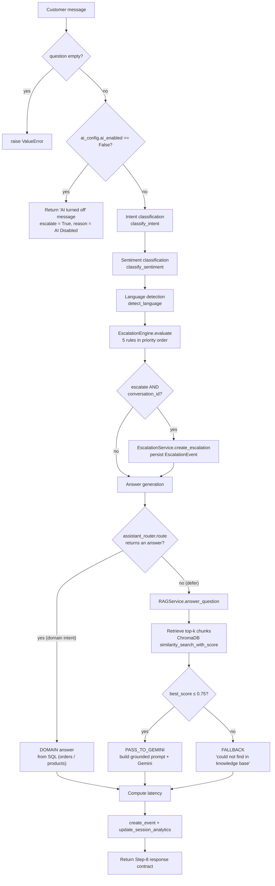

# The ICSA AI/ML Pipeline

> A deep technical walkthrough of how a single customer chat message travels through the
> Intelligent Customer Support Assistant (ICSA) and becomes a grounded, tenant-safe answer.
>
> This document is written so that a newcomer can read it once and then confidently explain
> the whole pipeline — NLU, escalation, RAG, and domain routing — in an interview. Every claim
> here is traced to a real file in this repository; file paths are given inline.

---

## 0. The one-paragraph summary

ICSA is a **multi-tenant AI customer-support assistant** for restaurants. When a customer sends a
message, a single conductor — `ConversationOrchestrator.orchestrate()` in
`backend/services/conversation_orchestrator.py` — runs three NLU classifiers (intent, sentiment,
language), evaluates a 5-rule escalation engine, and then generates the answer through **one of two
routes**: a *deterministic domain route* (order status, order edits, menu discovery,
recommendations — answered from SQL so facts are never hallucinated) or the *RAG route* (FAQs,
policies — answered by Google Gemini strictly grounded in retrieved knowledge-base chunks). The LLM
is **Google Gemini**, configured centrally in `backend/core/gemini_client.py` (chat model
`gemini-2.5-flash`, embedding model `models/gemini-embedding-2`). Vectors live in a
**per-tenant ChromaDB collection**, which is how one restaurant can never read another's knowledge.

---

## 1. End-to-end flow of one chat message

Everything below happens inside `ConversationOrchestrator.orchestrate()`
(`backend/services/conversation_orchestrator.py`). It is a `@staticmethod` that takes the DB session,
`restaurant_id`, the `question`, and optionally a `conversation_id` and `customer_id`.

### 1.1 The flow diagram



### 1.2 The steps, in code order

1. **Empty-query guard.** `if not question or not question.strip(): raise ValueError(...)`. An empty
   message is never processed.

2. **AI-enabled check (the kill switch).** The orchestrator reads the restaurant's AI settings via
   `RestaurantService.get_ai_config(db, restaurant_id)`. The defaults live in
   `backend/services/restaurant_service.py`:

   ```python
   DEFAULT_AI_CONFIG = {
       "ai_enabled": True,
       "greeting": "",
       "low_confidence_threshold": 0.6,
   }
   ```

   If `ai_config.get("ai_enabled") is False`, the pipeline **short-circuits immediately** and returns
   a canned "our AI assistant is currently turned off" reply with `escalation_result = {"escalate":
   True, "reason": "AI Disabled"}`. No classifiers, no LLM calls. This is the per-tenant toggle owners
   control from the dashboard (`frontend/components/restaurant_dashboard.py`).

3. **Intent classification.** `intent_result = classify_intent(question)`
   (see §2). Wrapped in `try/except` — any exception degrades to
   `{"intent": "Unknown", "confidence": 0.0, "layer": "Fallback"}`. The classifier is *injectable*
   (`intent_classifier` parameter) so tests can pass a stub; production uses the real one.

4. **Sentiment classification.** `sentiment_result = classify_sentiment(question)`; on error →
   `{"sentiment": "Neutral", "confidence": 0.0, "layer": "Fallback"}`.

5. **Language detection.** `language_result = detect_language(question)`; on error →
   `{"language": "Unknown", "code": "unknown", ...}`.

   > Every classifier is fault-tolerant *individually*. A crash in sentiment never stops intent or
   > language. This is deliberate: the pipeline must always produce *an* answer.

6. **Escalation evaluation + persistence.** An `EscalationEngine()` is constructed and
   `evaluate(...)` is called with the classified intent, sentiment, intent confidence, the raw query,
   and the **per-restaurant** `low_confidence_threshold` (default `0.60`). See §3. Then:

   ```python
   if escalation_result.get("escalate") and conversation_id:
       from backend.services.escalation_service import EscalationService
       EscalationService.create_escalation(
           db=db, conversation_id=conversation_id,
           reason=escalation_result.get("reason", "Unknown"),
       )
   ```

   An **`EscalationEvent` is only persisted when a `conversation_id` is present** — i.e. inside a real
   conversation, not a stateless one-off query. The whole block is `try/except`; a DB failure logs to
   stderr and falls back to `{"escalate": False, "reason": "Escalation Evaluation Failed"}` so the
   customer still gets an answer.

7. **Answer generation — the fork.** The orchestrator assembles NLU metadata:

   ```python
   nlu_metadata = {
       "intent": intent_result.get("intent"),
       "sentiment": sentiment_result.get("sentiment"),
       "language": language_result.get("language"),
       "language_code": language_result.get("code"),
   }
   ```

   Then it tries the **domain route first**:

   ```python
   from backend.services.assistant_router import route as domain_route
   domain_res = domain_route(db, restaurant_id, customer_id, question, intent_result["intent"])
   ```

   - If `domain_res is not None`, the answer came from live SQL. It is wrapped with
     `rag_decision = "DOMAIN"`, `chunks_used = 0` (see §5).
   - If `domain_res is None` (the router *deferred*), the message goes to the knowledge pipeline:
     `RAGService.answer_question(db, restaurant_id, question, metadata=nlu_metadata)` (see §4). The NLU
     metadata is forwarded so **sentiment shapes tone and language shapes the answer's language**.

8. **Latency + logging.** `latency_ms = (time.perf_counter() - start_time) * 1000.0`. The orchestrator
   prints a human-readable `[PIPELINE_LOG]` block (and a `[GROUNDED_PROMPT]` block when
   `decision == "PASS_TO_GEMINI"`) to stdout — these exist to satisfy `verify_language_integration.py`.

9. **Persist message + analytics.** An analytics event is built and logged:

   ```python
   event = create_event({ ... intent, sentiment, language, best_similarity_score,
                           rag_decision, retrieved_sources, latency_ms,
                           escalated, escalation_reason ... })
   if event:
       update_session_analytics(event)
   ```

   (`backend/analytics/event_logger.py`, `backend/analytics/session_analytics.py`.) Wrapped in
   `try/except` — analytics failures never break the reply.

10. **Return the Step-8 response contract** — a flat dict deliberately decoupled from internal
    structures: `answer`, `intent`, `sentiment`, `language`, `language_code`, `escalation_result`,
    `sources`, `chunks_used`, `latency_ms`, `response_source`, `prompt`, `error`, `exception`, plus the
    full `intent_info` / `sentiment_info` / `language_info` sub-dicts.

---

## 2. NLU classifiers — the hybrid two-layer design

All three classifiers share the same **two-layer architecture**, and this is the single most important
idea to be able to explain:

> **Layer 1 is fast, free, local rules. Layer 2 is a Gemini API call, used *only* when the rules are
> unsure.** The rule layer resolves the overwhelming majority of real traffic with zero latency and
> zero API cost; Gemini is the safety net for the ambiguous tail.

The pattern is identical in each file: `classify_X_rules()` returns `None` when it can't decide, and
the public `classify_X()` falls through to `classify_X_gemini()`:

```python
def classify_intent(query: str) -> Dict[str, Any]:
    if not query or not query.strip():
        return {"intent": "Out Of Scope", "confidence": 0.0, "layer": "Pre-processor"}
    rule_result = classify_intent_rules(query)   # Layer 1
    if rule_result is not None:
        return rule_result
    return classify_intent_gemini(query)         # Layer 2 (fallback only)
```
*(`backend/classifiers/intent_classifier.py`)*

Every result carries a `"layer"` field (`"Rule-Based"`, `"Gemini-Based"`, `"Fallback"`, …) so you can
always see *how* a classification was reached — this is logged into analytics.

### 2.1 Intent classifier — `backend/classifiers/intent_classifier.py`

**Layer 1** (`classify_intent_rules`) is an ordered cascade of regex checks. Order matters — it encodes
priority. The checks, in order:

1. **Escalation Request** — `manager`, `human`, `agent`, `representative`, `escalate`, `real person`, …
2. **Refund Inquiry** — `refund`, `money back`, `reimburse`
3. **Complaint** — `cold`, `late`, `wrong`, `burnt`, `hair`, `missing`, `wrong item`, …
4. **Order Tracking** — `track`, `status`, `where is my order`, `out for delivery`, …
5. **Order Modification** — `cancel ... order`, `change my order`, `add item`, `change toppings`, …
6. **Pickup Inquiry** — `pickup`, `collect`, `takeaway`
7. **Store Information** — `hours`, `address`, `location`, `phone`, `contact`
8. **Delivery Inquiry** — `delivery`, `deliver(y|ed|ing)`
9. **Menu Inquiry** — `menu`, `toppings`, `price`, `vegan`, `gluten free`, `pepperoni`, …
10. **General Greeting** — a short `^(hello|hi|hey|good morning|…)$` message of ≤ 3 words

If none match, Layer 1 returns `None`. Confidences are **calibrated constants**, not model
probabilities (`INTENT_CONFIDENCE_MAP`), e.g. `General Greeting → 0.99`, `Refund Inquiry → 0.95`,
`Menu Inquiry → 0.90`.

**Layer 2** (`classify_intent_gemini`) sends the message to Gemini with a strict system prompt that
enumerates **11 intents** (the 10 above **+ `Out Of Scope`** for unrelated questions like "who
discovered gravity?"). It demands a JSON-only response `{"intent": ..., "confidence": ...}`, strips any
stray markdown fences, and `json.loads` it. A notable boundary rule baked into the prompt: *"cancel my
order" → Order Modification, "I want a refund" → Refund Inquiry.* On **any** exception (quota, network,
bad JSON), it returns `{"intent": "Out Of Scope", "confidence": 0.0, "layer": "Gemini-Based (Error:
...)"}` — it never raises.

> **Full intent list:** General Greeting, Menu Inquiry, Delivery Inquiry, Pickup Inquiry, Refund
> Inquiry, Store Information, Complaint, Escalation Request, Order Tracking, Order Modification, Out Of
> Scope.

### 2.2 Sentiment classifier — `backend/classifiers/sentiment_classifier.py`

Three classes only: **`Positive` / `Neutral` / `Negative`** (`SENTIMENT_CONFIDENCE_MAP` =
`{Positive: 0.99, Negative: 0.95, Neutral: 0.90}`).

Layer 1 runs three keyword regexes (`pos_pattern`, `neg_pattern`, `neutral_pattern`). The clever part
is the **mixed-signal guard**:

```python
if has_pos and has_neg:
    return None   # ambiguous -> escalate to Gemini
```

So *"the pizza was good but delivery was slow"* — which trips both positive and negative rules — is
deliberately **deferred to Gemini** rather than guessed. Otherwise: positive wins, then negative, then
neutral; anything with no signal also returns `None` → Gemini. Layer 2 (`classify_sentiment_gemini`)
mirrors the intent fallback with a 3-way JSON prompt and degrades to `Neutral` on error.

### 2.3 Language detector — `backend/classifiers/language_detector.py`

Supported languages: **English (`en`), Hindi (`hi`), Spanish (`es`), French (`fr`), German (`de`)**,
plus `Unknown`.

Layer 1 detection signals:
- **Hindi** via Devanagari Unicode range `[ऀ-ॿ]` *or* a Hindi keyword set.
- **Spanish / French / German** via curated keyword sets (`hola/gracias`, `bonjour/merci`,
  `hallo/danke`, …).
- **English** only when Latin text is present, no other language dominates, and at least one
  `ENGLISH_HINTS` token (`hello`, `order`, `pizza`, `delivery`, …) appears among the non-foreign words.

**Mixed-language handling** is the interesting bit. If *more than one* language rule matches (e.g.
*"Hola, my order is late"* → Spanish + English), Layer 1 returns a `"Rule-Based Mixed"` marker carrying
a `fallback_language`. `detect_language()` then calls Gemini; if Gemini succeeds it wins, otherwise it
uses the dominant rule-based language at confidence `0.60` (`"Rule-Based Mixed Fallback"`). Single
match → returned directly (English `0.90`, others `0.99`). No match → straight to Gemini.

### 2.4 Why NLU output matters downstream

The detected values are not just logged — they actively shape the answer:

- **Language drives the answer's language.** In `backend/rag/prompt_builder.py`, when the detected
  language is not English/Unknown, the system prompt gains: *"The customer wrote in {language}. Reply in
  {language} using natural, fluent phrasing…"* (PRD Module 9, multilingual).
- **Sentiment drives tone.** The prompt gains an instruction to *"be empathetic for Negative sentiment,
  warm and appreciative for Positive"* — with the crucial guardrail that tone *"must NOT override the
  retrieved facts, trigger refunds/escalations, or modify restaurant policies."*
- **Intent drives routing** (§5) and **escalation** (§3).

> The two Gemini classifier calls (`classify_intent_gemini`, etc.) currently use `gemini-2.5-flash`
> hardcoded, whereas the RAG generation call uses the centrally-configured `CHAT_MODEL`
> (`gemini-2.5-flash`). Remember: Layer-2 calls only fire when Layer 1 is unsure, so this is the
> exception, not the rule.

---

## 3. Escalation engine — `backend/escalation/escalation_engine.py`

`EscalationEngine.evaluate()` runs **5 rules in strict priority order** and returns on the first match.
The first rule to fire wins and sets the escalation `reason`:

| # | Rule | Fires when | Reason string |
|---|------|-----------|---------------|
| 1 | Refund intent | `intent == "Refund Inquiry"` | `Refund Request` |
| 2 | Complaint intent | `intent == "Complaint"` | `Customer Complaint` |
| 3 | Human-assistance keywords | query matches `manager`, `human`, `support agent`, `representative`, `customer service`, `agent`, `staff`, `real person`, `speak to someone`, `talk to someone` | `Human Assistance Requested` |
| 4 | Negative sentiment | `sentiment == "Negative"` | `Negative Sentiment` |
| 5 | Low confidence | `confidence < low_confidence_threshold` | `Low Confidence` |

If none fire: `{"escalate": False, "reason": "No Escalation Required"}`.

```python
def evaluate(self, intent, sentiment, confidence, query, low_confidence_threshold=0.60):
    if self._check_refund_inquiry(intent):        return {...Refund Request}
    if self._check_complaint(intent):             return {...Customer Complaint}
    if self._check_human_assistance(query):       return {...Human Assistance Requested}
    if self._check_negative_sentiment(sentiment): return {...Negative Sentiment}
    if self._check_low_confidence(confidence, low_confidence_threshold): return {...Low Confidence}
    return {"escalate": False, "reason": "No Escalation Required"}
```

**The low-confidence threshold is configurable per restaurant.** The orchestrator passes
`ai_config.get("low_confidence_threshold", 0.60)`, which comes from the restaurant's `ai_config`
(default `0.6`, editable from the dashboard's "Low-confidence escalation threshold" slider in
`frontend/components/restaurant_dashboard.py`). Rule 5 means: *if the assistant isn't confident it
understood the customer, hand off to a human* — and each restaurant tunes how cautious that is.

Note rule 3 is intent-independent — it scans the **raw query text** directly, so "can I talk to
someone" escalates even if the intent classifier labeled it something else.

---

## 4. RAG — retrieval-augmented generation

This is the route for everything the domain router *doesn't* handle: FAQs, policies, delivery/pickup
info, general questions. Entry point: `RAGService.answer_question()` in `backend/rag/rag_service.py`.

### 4.1 Indexing (offline / on document change)

Before retrieval can work, documents must be chunked, embedded, and stored. This happens in
`backend/rag/vector_store.py` and its helpers.

**Load** (`backend/rag/document_loader.py`): `.txt` files (or `KnowledgeDocument` rows from SQL) become
LangChain `Document`s, tagged with `source`, `restaurant_id`, `document_id`, `document_type` metadata.

**Chunk** (`backend/rag/text_splitter.py`): a `RecursiveCharacterTextSplitter` with
**`chunk_size=1000`, `chunk_overlap=200`**. The 200-char overlap prevents a fact from being cut in
half at a chunk boundary. Metadata is copied onto every child chunk automatically.

```python
splitter = RecursiveCharacterTextSplitter(chunk_size=1000, chunk_overlap=200)
chunks = splitter.split_documents(documents)
```

**Embed** (`backend/rag/embedder.py`): `GeminiEmbedder` wraps Google's `models/gemini-embedding-2`
(`EMBED_MODEL`). It implements LangChain's `Embeddings` interface (`embed_documents`, `embed_query`) and
distinguishes task types — `task_type="retrieval_document"` for stored chunks vs
`task_type="retrieval_query"` for the incoming question, which improves retrieval quality. It also has
**exponential-backoff-with-jitter retries** (`_call_with_retry`, up to 6 attempts) specifically for
free-tier `429 / quota / resource_exhausted / rate limit` errors, and sanitizes empty strings to a
single space so the API never rejects a blank chunk.

**Store — this is how tenant isolation works.** In `vector_store.py`, each restaurant gets its **own
ChromaDB collection in its own directory**:

```python
db = Chroma(
    collection_name=f"restaurant_kb_{restaurant_id}",
    embedding_function=embeddings,
    persist_directory=persist_dir,   # data/chroma_db/<restaurant_id>
)
```

- **Persist dir:** `data/chroma_db/<restaurant_id>`
- **Collection name:** `restaurant_kb_<restaurant_id>`

Because retrieval always resolves the path/collection from `restaurant_id`, **one restaurant's query
can only ever touch its own vectors** — there is no shared index and no cross-tenant filter to get
wrong. Vector-level multi-tenancy is enforced by physical separation. (There's also a fail-fast
embedding-dimension check that refuses to serve a store whose vectors don't match the current model's
dimensions.)

### 4.2 Retrieval (online)

`retrieve_relevant_chunks_with_metadata(restaurant_id, question)` in `backend/rag/retriever.py`:

```python
persist_dir = os.path.join(root_dir, "data", "chroma_db", restaurant_id)
if not os.path.exists(persist_dir):
    return []                       # no KB yet -> caller falls back
db = load_vector_store(restaurant_id, persist_dir)
results = db.similarity_search_with_score(query, k=5)
```

- **`k = 5`** — the top 5 nearest chunks.
- It returns the **L2 distance `score`** alongside each chunk (lower = closer). Returning the score from
  the *same* retrieval call is a deliberate optimization: the RAG service does **not** need a second
  embedding round-trip just to compute similarity.
- If the tenant has no vector store, it returns `[]`.

### 4.3 The distance-threshold decision — PASS_TO_GEMINI vs FALLBACK

This is the retrieval-quality gate, and the anti-hallucination guardrail's first line of defense
(`rag_service.py`):

```python
best_score = retrieved_chunks[0].get("score", 1.0)   # closest chunk's distance
threshold = 0.75
if best_score <= threshold:
    decision = "PASS_TO_GEMINI"    # good enough match -> let Gemini answer
    response_source = "Gemini"
else:
    decision = "FALLBACK"          # nothing close enough -> refuse
    response_source = "System Fallback"
```

- **`best_score <= 0.75` → `PASS_TO_GEMINI`.** The closest chunk is semantically close enough; build the
  grounded prompt and call Gemini.
- **`best_score > 0.75` → `FALLBACK`.** Nothing in the KB is relevant. **Do not call the LLM at all** —
  return the fixed refusal *"I could not find that information in the restaurant knowledge base."*
- **Empty KB** (no chunks retrieved) → immediate `FALLBACK` with `best_score = 1.0`.

The insight: rather than let Gemini answer from thin context and risk making something up, ICSA refuses
when retrieval is weak. Refusing is safer than hallucinating a policy or price.

### 4.4 The grounded prompt (the second anti-hallucination guardrail)

When `PASS_TO_GEMINI`, `build_rag_prompt()` (`backend/rag/prompt_builder.py`) assembles the prompt. Its
system instructions are aggressively anti-hallucination:

```python
system_instructions = (
    f"You are a helpful customer support assistant for {resolved_name}.\n\n"
    "Use ONLY the provided context to answer the user's question.\n\n"
    "If the answer cannot be found in the context, reply:\n\n"
    '"I could not find that information in the restaurant knowledge base."'
)
# ... later ...
system_instructions += (
    "\n\nOnly answer using the provided knowledge. Do not invent, extrapolate, or hallucinate "
    "any details, including menu items, prices, policies, opening hours, or restaurant information."
)
```

On top of the base instructions, the NLU metadata is conditionally injected:
- **Sentiment** → tone guidance (empathetic / warm) *with* the "tone only, never override facts" clamp.
- **Language** → "reply in {language}" when non-English.

Then the retrieved chunks are formatted into a `Context:` block (`[Chunk 1] Source: ... (Type: ...)`),
followed by the metadata-tagged user query, ending in `Answer:`. So the model receives: strict rules +
tone/language shaping + the exact retrieved evidence + the question.

### 4.5 Generation and graceful degradation

```python
genai.configure(api_key=GEMINI_API_KEY)
model = genai.GenerativeModel(CHAT_MODEL)     # gemini-2.5-flash
response = model.generate_content(prompt)
if not response or not response.text:
    raise RuntimeError("Empty response from Gemini API.")
answer_text = response.text
```

If `GEMINI_API_KEY` is missing, or **any** exception occurs (quota, rate limit, empty response), the
service returns `{"answer": "The knowledge assistant is temporarily unavailable.", "error": True,
"exception": e, ...}` instead of crashing. Finally, sources are **deduplicated by `document_id`** so the
customer sees each source document once, not once per chunk.

---

## 5. Domain routing — `backend/services/assistant_router.py`

Some questions must **never** be answered from a static knowledge base, because the true answer lives in
live, per-customer structured data. The domain router handles four such intents deterministically from
SQL:

| Intent | Answered from | Service |
|--------|--------------|---------|
| Order Tracking | `orders` table | `OrderService.get_order_status` |
| Order Modification | `orders` table + business rules | `OrderService.modify_order` |
| Menu discovery (filtered Menu Inquiry) | `products` table | `MenuService.discover` |
| Personalized recommendations | customer order history | `OrderService.get_recommendations` |

**Why deterministic instead of RAG?** Correctness. "Where is order #1254?" or "what's on the vegan menu
under ₹300?" are *facts about the current database state*. An LLM answering these from retrieved text
would risk inventing a status, price, or ETA. By reading SQL directly, the answer is always exactly
correct — no hallucination possible on facts. `route()` returns a dict for these; **returning `None`
means "let RAG handle it."**

### 5.1 Order number extraction

`extract_order_number()` (`backend/services/order_service.py`) pulls an order number out of free text
with `_ORDER_NUM_RE = re.compile(r"#?\s*(\d{3,})")` — matching `#1254`, `order 1254`, etc. (3+ digits).
For Order Tracking, if there's neither a signed-in `customer_id` nor an order number, the router asks the
customer to sign in or provide a number. Ownership is enforced downstream: `get_order_status` nulls the
result if `order.customer_id != customer_id`, so a customer can only ever see **their own** orders.

### 5.2 The 5-minute modification window

`OrderService` defines `MODIFY_WINDOW_MINUTES = 5`. `can_modify()` enforces the business rule:

```python
if order.status in ("delivered", "completed", "cancelled"): return {"allowed": False, ...}
if order.status in ("out_for_delivery", "ready"):           return {"allowed": False, ...}
mins = _minutes_since(order.placed_at)
if mins > MODIFY_WINDOW_MINUTES:
    return {"allowed": False, "reason": "Orders can only be changed within 5 minutes ..."}
return {"allowed": True, ...}
```

So an order can only be modified if it hasn't left the kitchen **and** it was placed within the last 5
minutes. `modify_order()` records the change as a note on the order (a real POS integration would
re-price the cart).

### 5.3 Menu discovery vs plain menu questions

Only a `Menu Inquiry` that *also* matches `_DISCOVERY_RE` (`recommend`, `popular`, `vegan`, `gluten`,
`under ₹...`, `for me`, …) is handled by the domain route. `_menu_answer()` parses dietary tags
(`_detect_dietary`), a price ceiling (`_PRICE_RE`, e.g. "under ₹300"), and popularity, then calls
`MenuService.discover(...)` (tenant-scoped structured filtering). A bare "what's on the menu?" doesn't
match `_DISCOVERY_RE`, so it **falls through to RAG** and the free-text menu document. Crucially, when a
structured filter finds nothing, `_menu_answer` returns `None` rather than a dead end — RAG gets a
chance instead of the customer hitting a wall. `MenuService.format_for_prompt()` renders prices
explicitly so nothing is ever invented.

---

## 6. Mapping to the PRD "AI & Machine Learning Architecture" (Layers 1–6)

The blueprint (`ICSA_Blueprint_v3.1_Final_Master_Blueprint.md`, PRD Section 9) describes a 6-layer AI
stack. Here is each layer mapped to concrete code:

| PRD layer | What it is | Where it lives in the code |
|-----------|-----------|----------------------------|
| **Layer 1 — Data Collection** | Ingesting customer messages, KB documents, orders, feedback | Chat entry → `ConversationOrchestrator.orchestrate()`; KB ingestion via `document_loader.py`; message/analytics persistence via `event_logger.py` + `session_analytics.py`; `conversations`/`messages` tables |
| **Layer 2 — Processing** | Cleaning/normalizing input, extracting features (keywords, order numbers, price ceilings) | Text normalization inside each `classify_*_rules`; `extract_order_number`, `_detect_dietary`, `_PRICE_RE` in the domain router; empty-query guard |
| **Layer 3 — ML models (intent & sentiment classification)** | Classifying intent and sentiment | `backend/classifiers/intent_classifier.py`, `sentiment_classifier.py`, `language_detector.py` — the rule layer + calibrated confidences; escalation decisioning in `escalation_engine.py` |
| **Layer 4 — Deep Learning (transformer embeddings)** | Turning text into dense semantic vectors | `GeminiEmbedder` (`embedder.py`) using the transformer embedding model `models/gemini-embedding-2`; stored in ChromaDB (`vector_store.py`) |
| **Layer 5 — LLM layer (Gemini)** | Natural-language generation & the classifier fallback | `backend/core/gemini_client.py` (central config, `CHAT_MODEL = gemini-2.5-flash`); generation call in `rag_service.py`; Layer-2 classifier fallbacks |
| **Layer 6 — RAG** | Retrieval + grounded generation | `rag_service.py` + `retriever.py` + `prompt_builder.py` — retrieve top-k, threshold gate, grounded prompt, refuse-when-unsure |

The orchestrator is what *stitches these layers together* for a single request; the domain router
(`assistant_router.py`) is an explicit design decision to **bypass Layers 4–6 for factual queries** and
answer from structured data instead — trading generative flexibility for guaranteed correctness.

---

## 7. Free-tier notes

ICSA is built to run on Google Gemini's **free API tier**, which shapes several design choices in
`backend/core/gemini_client.py`:

- **Fast "lite" chat model by default.** `CHAT_MODEL` defaults to `gemini-2.5-flash`. The code
  comment is explicit: it is chosen because it is fast (no heavy "thinking" step, unlike
  `gemini-2.5-flash` which the author measured at ~8s/response) **and** has a more generous free-tier
  request rate. Both matter when requests-per-minute is tightly capped.
- **Models are overridable via env vars.** `CHAT_MODEL = os.getenv("GEMINI_CHAT_MODEL",
  "gemini-2.5-flash")` and `EMBED_MODEL = os.getenv("GEMINI_EMBED_MODEL",
  "models/gemini-embedding-2")`. Drop in a stronger model with a paid key by setting `GEMINI_CHAT_MODEL`
  — no code change.
- **Retry-with-backoff on embeddings.** `GeminiEmbedder._call_with_retry` retries up to 6 times with
  exponential backoff + jitter specifically on `429 / quota / resource_exhausted / rate limit` errors,
  absorbing transient free-tier throttling during indexing.
- **Graceful degradation on quota/API errors.** The pipeline **never crashes** on an LLM failure:
  - RAG generation errors → `"The knowledge assistant is temporarily unavailable."` with `error: True`.
  - Weak retrieval → `"I could not find that information in the restaurant knowledge base."` (no LLM
    call at all — saves quota).
  - Classifier Gemini-fallback errors → safe defaults (`Out Of Scope` / `Neutral` / `Unknown`).
  - Any orchestrator-level classifier exception → `"Fallback"`-layer defaults.

The net effect: even when the free tier is exhausted or the network hiccups, a customer always receives
a coherent, safe response, and the analytics log records exactly which path (and which failure) occurred.

---

## Appendix — key files at a glance

| Concern | File |
|---------|------|
| Pipeline conductor | `backend/services/conversation_orchestrator.py` |
| Central Gemini config | `backend/core/gemini_client.py` |
| Intent / sentiment / language NLU | `backend/classifiers/*.py` |
| Escalation rules | `backend/escalation/escalation_engine.py` |
| RAG orchestration | `backend/rag/rag_service.py` |
| Retrieval | `backend/rag/retriever.py` |
| Embeddings | `backend/rag/embedder.py` |
| Vector store (per-tenant ChromaDB) | `backend/rag/vector_store.py` |
| Chunking | `backend/rag/text_splitter.py` |
| Grounded prompt | `backend/rag/prompt_builder.py` |
| Document loading | `backend/rag/document_loader.py` |
| Domain routing | `backend/services/assistant_router.py` |
| Order logic (status / modify / recs) | `backend/services/order_service.py` |
| Menu discovery | `backend/services/menu_service.py` |
| Per-restaurant AI config | `backend/services/restaurant_service.py` |
