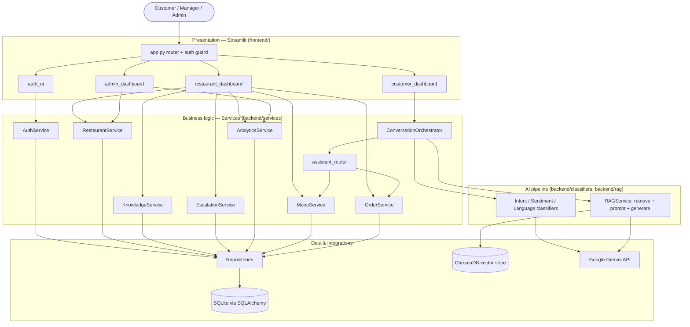

# ICSA — System Architecture

This document explains how the Intelligent Customer Support Assistant (ICSA) is
put together: its layers, how a chat message flows through the system, the
technology choices, and the reasoning behind them. Read this first — the other
docs ([backend](backend.md), [frontend](frontend.md),
[ai-pipeline](ai-pipeline.md), [database](database.md)) go deeper on each part.

---

## 1. What ICSA is

ICSA is a **multi-tenant, AI-powered customer-support assistant** for a
multi-restaurant food-ordering platform. Each restaurant ("tenant") gets a
chatbot that answers customer questions using **only that restaurant's own
data** — its menu, policies, delivery rules, FAQs — plus live order data.

Three types of user share one application:

| Role | What they do |
| --- | --- |
| **Customer** | Chats with a restaurant's assistant, browses its menu, tracks their orders. |
| **Restaurant manager** | Manages their restaurant's profile, uploads knowledge documents, manages the menu, configures the AI, reviews escalated tickets, sees analytics. |
| **Platform admin** | Sees platform-wide analytics, all restaurants and users. |

---

## 2. Architectural style: a modular monolith

ICSA is a **single Python application** with a clean layered structure. The
Streamlit UI calls Python service classes **directly** (in-process) — there is
no separate HTTP API between them.



**Why a monolith?** For a project of this size it is the right call: one process
to run and deploy, no network hops or serialization between UI and logic, and
the layering (UI → services → repositories → DB) still keeps concerns cleanly
separated. The services never import Streamlit, so the same business logic could
later be exposed over HTTP (e.g. FastAPI) without change.

### The layers

1. **Presentation** (`frontend/`) — Streamlit. Renders pages, holds session
   state, enforces role-based page access. Contains **no business logic**.
2. **Services** (`backend/services/`) — the use-cases: authentication, the chat
   orchestrator, knowledge ingestion, escalation, analytics, menu, orders. Each
   enforces authorization and tenant isolation.
3. **Repositories** (`backend/repositories/`) — thin data-access classes; the
   only layer that builds SQL queries. Every tenant-scoped query filters on
   `restaurant_id`.
4. **Models** (`backend/models/`) — SQLAlchemy ORM table definitions.
5. **AI pipeline** (`backend/classifiers/`, `backend/rag/`) — the NLU
   classifiers and the Retrieval-Augmented Generation stack.

---

## 3. The core flow: what happens on one chat message

When a customer sends a message, `ConversationOrchestrator.orchestrate()` runs a
fixed pipeline (see [ai-pipeline.md](ai-pipeline.md) for detail):

```
Customer message
   │
   ▼
1. AI enabled?  ── no ──▶ "a staff member will follow up"  (per-restaurant toggle)
   │ yes
   ▼
2. NLU: classify Intent, Sentiment, Language      (rules first, Gemini fallback)
   │
   ▼
3. Escalation check (refund? complaint? negative? asks for human? low confidence?)
   │      └─▶ if yes: persist an EscalationEvent, mark the conversation escalated
   ▼
4. Answer generation — two routes:
   ├─ DOMAIN route  (order status / order change / menu discovery / recommendations)
   │      → answered from live SQL data, deterministically (never hallucinated)
   └─ RAG route     (FAQs, policies, delivery, hours, general questions)
          → retrieve the restaurant's knowledge chunks from ChromaDB,
            build a grounded prompt, call Gemini
   │
   ▼
5. Persist the message + NLU metadata + latency; update analytics
   │
   ▼
Answer (with source citations) back to the customer
```

The key idea is the **two answer routes**. Facts that live in the database
(order status, prices, structured menu) are answered *deterministically* so they
are always correct. Open-ended knowledge questions go through *RAG*, which
grounds Gemini in the restaurant's own documents to prevent hallucination.

---

## 4. Multi-tenancy & isolation (the most important requirement)

The PRD demands: **"Restaurant A data must never appear for Restaurant B."**
ICSA enforces this at every layer:

- **Relational data** — every tenant-owned table has a `restaurant_id`, and
  every repository query filters on it. Services additionally check the caller's
  role/tenant via `verify_tenant_access` before returning data.
- **Vector data** — each restaurant's documents are embedded into a **separate
  ChromaDB collection in a separate directory** (`data/chroma_db/<restaurant_id>`,
  collection `restaurant_kb_<restaurant_id>`). A retrieval for one restaurant
  physically cannot read another's vectors.
- **Orders** — order lookups are scoped by both `restaurant_id` and
  `customer_id`, so a customer only ever sees their own orders.

---

## 5. Technology stack & why

| Concern | Choice | Why |
| --- | --- | --- |
| UI | **Streamlit** | Fast to build data/AI apps in pure Python; no separate frontend stack. |
| Language | **Python 3.13** | Matches the AI/ML ecosystem. |
| LLM | **Google Gemini** (`gemini-2.5-flash` chat, `gemini-embedding-2` embeddings) | Available on the free tier and produces reliably grounded answers; the chat model is configurable via `GEMINI_CHAT_MODEL` (swap to a faster/stronger model on a paid key). |
| RAG framework | **LangChain + ChromaDB** | LangChain gives standard splitter/embeddings/vectorstore interfaces; Chroma is a simple, file-based vector DB — no server to run. |
| Database | **SQLite + SQLAlchemy 2.0** | Zero-setup relational store; SQLAlchemy models are portable to Postgres later. |
| Migrations | **Alembic** | Versioned, repeatable schema changes — the single source of truth for the schema. |
| Auth | **bcrypt + PyJWT** | Standard password hashing + stateless JWT sessions with role claims. |

See [ai-pipeline.md](ai-pipeline.md) for the AI/ML layer mapping (NLU, DL/
transformer embeddings, LLM, RAG) to the PRD's "AI & ML Architecture" section.

---

## 6. Directory map

```
backend/
  classifiers/   intent / sentiment / language detection (rules + Gemini)
  core/          config, security (bcrypt/JWT), permissions (RBAC),
                 tenant isolation helpers, Gemini client, document types
  database/      engine/session + Alembic migrations
  models/        SQLAlchemy tables (user, restaurant, conversation, message,
                 feedback, escalation, product, order)
  rag/           embedder, vector store, retriever, splitter, prompt builder,
                 RAGService (the RAG orchestrator)
  repositories/  data-access classes (one per aggregate)
  services/      business logic (auth, restaurant, knowledge, ingestion,
                 conversation orchestrator, assistant_router, menu, order,
                 escalation, analytics, feedback)
frontend/
  app.py         router + auth guard
  components/    auth_ui, sidebar, customer/restaurant/admin dashboards
  utils/         session state + auth helpers
scripts/         seed.py (demo data + vector index), smoke_test.py
data/            SQLite DB, per-restaurant knowledge text, Chroma index
docs/            these documents
```

---

## 7. Design decisions worth knowing (and defending in an interview)

- **Deterministic domain answers vs. RAG.** Order status and prices come from
  SQL, not the LLM — correctness and no hallucination on facts that matter.
- **Rules-first NLU with an LLM fallback.** Cheap, fast keyword/regex rules
  handle the common cases; Gemini only runs when the rules are unsure. This cuts
  cost and latency and reduces exposure to the free-tier rate limit.
- **Grounded generation.** The RAG prompt instructs Gemini to answer *only* from
  the retrieved context and to refuse otherwise — the anti-hallucination
  guardrail the PRD asks for.
- **Alembic as the schema source of truth.** The app never calls
  `create_all()`; the schema is always the migration chain, so dev, Docker, and
  any future Postgres deployment stay consistent.
- **Config in one place.** Database URL, JWT settings, admin seed, and Gemini
  model names are centralized (`backend/core/config.py`, `gemini_client.py`).
