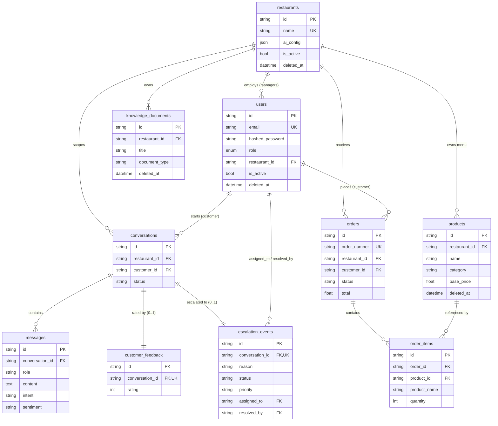

# ICSA — Database & Schema

This document is the reference for ICSA's **data layer**: every table, its
columns, the relationships between them, how migrations are managed with
Alembic, and how multi-tenant isolation is enforced at the database level.

For how the code *uses* this schema (repositories, services, tenant checks) see
[backend.md](backend.md); for the overall system see
[architecture.md](architecture.md).

**Stack:** SQLAlchemy 2.0 declarative models over **SQLite**, with **Alembic**
managing all schema changes. The engine, `SessionLocal` factory, and shared
`Base` live in `backend/database/database.py`. The active database file is chosen
by `APP_ENV` (see [backend.md §4](backend.md#4-core-utilities-backendcore) —
`development` → `data/saas.db`).

---

## 1. Entity-relationship overview

Nine tables model three domains: **tenancy/identity** (users, restaurants),
**conversations** (conversations, messages, customer_feedback, escalation_events),
and **commerce** (products, orders, order_items). `restaurants` is the tenant
root — almost everything hangs off it directly or transitively.



**Conventions shared by all tables**

- **Primary keys** are `String(36)` UUID4 strings, generated in Python
  (`default=lambda: str(uuid.uuid4())`) — not DB auto-increment.
- **Timestamps** use `server_default=func.now()` (rendered as
  `CURRENT_TIMESTAMP`); `updated_at` also has `onupdate=func.now()`.
- **Soft-delete**: users, restaurants, knowledge_documents, and products carry a
  nullable `deleted_at`. Conversations, messages, feedback, escalations, orders,
  and order_items do **not** — they are removed via `ON DELETE CASCADE`.

---

## 2. Per-table field reference

### `users` — `backend/models/user.py`

Identity for all three roles (customer, restaurant manager, admin).

| Column | Type | Nullable | Notes |
| --- | --- | :---: | --- |
| `id` | String(36) | no | PK, UUID4 |
| `email` | String(255) | no | Unique, indexed (`ix_users_email`); stored lowercased |
| `hashed_password` | String(255) | no | bcrypt hash |
| `role` | Enum(`customer`,`restaurant`,`admin`) | no | `userrole` enum; default `customer` |
| `first_name` | String(100) | yes | |
| `last_name` | String(100) | yes | |
| `is_active` | Boolean | no | default true; false disables login |
| `deleted_at` | DateTime(tz) | yes | soft-delete marker |
| `created_at` | DateTime(tz) | no | `CURRENT_TIMESTAMP` |
| `updated_at` | DateTime(tz) | no | `CURRENT_TIMESTAMP`, `onupdate` |
| `restaurant_id` | String(36) | yes | **FK → restaurants.id**; set for managers, null for customers/admin |

### `restaurants` — `backend/models/restaurant.py`

The tenant root.

| Column | Type | Nullable | Notes |
| --- | --- | :---: | --- |
| `id` | String(36) | no | PK, UUID4 |
| `name` | String(255) | no | Unique, indexed (`ix_restaurants_name`) |
| `phone` | String(50) | yes | |
| `address` | String(255) | yes | |
| `description` | String(500) | yes | |
| `contact_email` | String(255) | yes | profile field |
| `business_hours` | JSON | yes | profile field |
| `delivery_available` | Boolean | no | default true (`server_default '1'`) |
| `delivery_notes` | String(500) | yes | |
| `status_message` | String(255) | yes | |
| `ai_config` | JSON | yes | per-tenant AI settings: `ai_enabled`, `greeting`, `low_confidence_threshold` (JSON so the shape can evolve without a migration) |
| `is_active` | Boolean | no | default true |
| `deleted_at` | DateTime(tz) | yes | soft-delete marker |
| `created_at` / `updated_at` | DateTime(tz) | no | timestamps |

### `knowledge_documents` — `backend/models/knowledge_document.py`

Per-tenant RAG source documents (also mirrored into ChromaDB).

| Column | Type | Nullable | Notes |
| --- | --- | :---: | --- |
| `id` | String(36) | no | PK, UUID4 |
| `restaurant_id` | String(36) | no | **FK → restaurants.id**, indexed |
| `title` | String(255) | no | |
| `content` | Text | no | normalized parsed text |
| `document_type` | String(100) | no | one of `document_types.DOCUMENT_TYPES` |
| `created_at` / `updated_at` | DateTime(tz) | no | timestamps |
| `deleted_at` | DateTime(tz) | yes | soft-delete marker |

### `conversations` — `backend/models/conversation.py`

A support chat session, scoped to a tenant and (optionally) a customer.

| Column | Type | Nullable | Notes |
| --- | --- | :---: | --- |
| `id` | String(36) | no | PK, UUID4 |
| `restaurant_id` | String(36) | no | **FK → restaurants.id** `ON DELETE CASCADE`, indexed |
| `customer_id` | String(36) | yes | **FK → users.id** `ON DELETE CASCADE`, indexed; null for anonymous chats |
| `status` | String(50) | no | `active` → `escalated`/`resolved`; default `active` |
| `created_at` / `updated_at` | DateTime(tz) | no | timestamps |

### `messages` — `backend/models/message.py`

One turn of a conversation, carrying the full NLU trace used by analytics.

| Column | Type | Nullable | Notes |
| --- | --- | :---: | --- |
| `id` | String(36) | no | PK, UUID4 |
| `conversation_id` | String(36) | no | **FK → conversations.id** `ON DELETE CASCADE`, indexed |
| `role` | String(20) | no | `user` / `assistant` / `system` |
| `content` | Text | no | message body |
| `intent` | String(100) | yes | classified intent |
| `intent_confidence` | Float | yes | |
| `sentiment` | String(50) | yes | |
| `sentiment_confidence` | Float | yes | |
| `language` | String(50) | yes | |
| `language_code` | String(10) | yes | |
| `latency_ms` | Float | yes | assistant response latency (fuels avg-latency metric) |
| `escalated` | Boolean | no | default false |
| `sources` | JSON | yes | RAG source references |
| `timestamp` | DateTime(tz) | no | `CURRENT_TIMESTAMP` |

### `customer_feedback` — `backend/models/customer_feedback.py`

CSAT rating for a conversation. **One row per conversation** (unique FK).

| Column | Type | Nullable | Notes |
| --- | --- | :---: | --- |
| `id` | String(36) | no | PK, UUID4 |
| `conversation_id` | String(36) | no | **FK → conversations.id** `ON DELETE CASCADE`, **unique**, indexed |
| `rating` | Integer | no | 1–5 (validated in service + repository) |
| `feedback_text` | Text | yes | optional comment |
| `created_at` | DateTime(tz) | no | timestamp |

### `escalation_events` — `backend/models/escalation_event.py`

Human-handoff ticket for a conversation. **One per conversation** (unique FK).

| Column | Type | Nullable | Notes |
| --- | --- | :---: | --- |
| `id` | String(36) | no | PK, UUID4 |
| `conversation_id` | String(36) | no | **FK → conversations.id** `ON DELETE CASCADE`, **unique**, indexed |
| `reason` | String(255) | no | e.g. `Refund Request`, `Negative Sentiment` |
| `status` | String(50) | no | `pending` → `claimed` → `resolved`; default `pending`, indexed |
| `priority` | String(20) | no | `low`/`medium`/`high`; default `medium`, indexed |
| `notes` | Text | yes | internal manager notes |
| `assigned_to` | String(36) | yes | **FK → users.id** `ON DELETE SET NULL` (claiming manager) |
| `resolution_summary` | Text | yes | |
| `resolved_by` | String(36) | yes | **FK → users.id** `ON DELETE SET NULL` |
| `resolved_at` | DateTime | yes | |
| `claimed_at` | DateTime | yes | |
| `created_at` / `updated_at` | DateTime | no | timestamps |

### `products` — `backend/models/product.py`

A menu item belonging to one tenant. Powers Menu Discovery.

| Column | Type | Nullable | Notes |
| --- | --- | :---: | --- |
| `id` | String(36) | no | PK, UUID4 |
| `restaurant_id` | String(36) | no | **FK → restaurants.id** `ON DELETE CASCADE`, indexed |
| `name` | String(255) | no | |
| `description` | Text | yes | free-text (also RAG-indexable) |
| `category` | String(120) | no | menu section; indexed |
| `base_price` | Float | no | default 0.0 (smallest size) |
| `size_prices` | JSON | yes | variant pricing, e.g. `{"Medium 12\"": 499}` |
| `dietary_tags` | JSON | yes | e.g. `["vegan"]` |
| `allergens` | JSON | yes | e.g. `["Milk"]` |
| `is_popular` | Boolean | no | default false |
| `is_available` | Boolean | no | default true |
| `created_at` / `updated_at` | DateTime(tz) | no | timestamps |
| `deleted_at` | DateTime(tz) | yes | soft-delete marker |

### `orders` — `backend/models/order.py`

A customer order for one tenant. `order_number` is the short reference customers
use in chat ("where is #1254?").

| Column | Type | Nullable | Notes |
| --- | --- | :---: | --- |
| `id` | String(36) | no | PK, UUID4 |
| `order_number` | String(20) | no | **Unique** across platform, indexed |
| `restaurant_id` | String(36) | no | **FK → restaurants.id** `ON DELETE CASCADE`, indexed |
| `customer_id` | String(36) | yes | **FK → users.id** `ON DELETE SET NULL`, indexed (order history survives user deletion) |
| `status` | String(50) | no | one of `order.ORDER_STATUSES`; default `placed`, indexed |
| `order_type` | String(20) | no | `delivery`/`pickup`; default `delivery` |
| `delivery_address` | String(500) | yes | |
| `subtotal` | Float | no | default 0.0 |
| `delivery_fee` | Float | no | default 0.0 |
| `tax` | Float | no | default 0.0 |
| `total` | Float | no | default 0.0 (`subtotal + fee + tax`, computed in repo) |
| `payment_method` | String(50) | yes | |
| `payment_status` | String(20) | no | `paid`/`cod`/`pending`; default `pending` |
| `notes` | Text | yes | special instructions (order-modification target) |
| `placed_at` | DateTime(tz) | no | drives the 5-minute modification window |
| `estimated_ready_at` | DateTime(tz) | yes | powers ETA answers |
| `created_at` / `updated_at` | DateTime(tz) | no | timestamps |

### `order_items` — `backend/models/order.py`

A line item within an order.

| Column | Type | Nullable | Notes |
| --- | --- | :---: | --- |
| `id` | String(36) | no | PK, UUID4 |
| `order_id` | String(36) | no | **FK → orders.id** `ON DELETE CASCADE`, indexed |
| `product_id` | String(36) | yes | **FK → products.id** `ON DELETE SET NULL` (order history outlives menu changes) |
| `product_name` | String(255) | no | denormalized snapshot of what was ordered |
| `size` | String(60) | yes | |
| `quantity` | Integer | no | default 1 |
| `unit_price` | Float | no | default 0.0 |
| `line_total` | Float | no | default 0.0 (`quantity × unit_price`) |
| `modifiers` | JSON | yes | e.g. `{"added": ["Extra Mozzarella"]}` |

---

## 3. Relationships & cascade behavior

Defined in the SQLAlchemy models via `relationship(...)` plus the FK
`ondelete=` rules (the DB-level enforcement lives in the migrations).

**One-to-many**

- `restaurants` → `users` (managers), `knowledge_documents`, `conversations`,
  `products`, `orders`.
- `users` (as customer) → `conversations`, `orders`.
- `conversations` → `messages`.
- `orders` → `order_items`; `products` → `order_items`.

**One-to-one (0..1)**

- `conversations` → `customer_feedback` — `uselist=False`, enforced by a
  **unique** `conversation_id`.
- `conversations` → `escalation_events` — `uselist=False`, enforced by a
  **unique** `conversation_id` (a conversation escalates at most once; creation is
  idempotent in `EscalationService`).

**Cascade / delete semantics**

- **`cascade="all, delete-orphan"`** in the ORM: `Conversation.messages`,
  `Conversation.feedback`, `Conversation.escalation_event`, and `Order.items`.
  Deleting a conversation removes its messages/feedback/escalation; deleting an
  order removes its items.
- **`ON DELETE CASCADE`** (DB-level, in the FKs): conversations, messages,
  feedback, escalations, products, orders, and order_items all cascade from their
  parent (`restaurants` for tenant-owned tables, `conversations`/`orders` for
  children). So deleting a tenant tears down its entire subtree.
- **`ON DELETE SET NULL`**: `orders.customer_id`, `order_items.product_id`, and
  `escalation_events.assigned_to` / `resolved_by`. These preserve historical
  records (an order's history, who handled an escalation) even after the
  referenced user/product is gone.
- **Soft-delete instead of delete**: for `users`, `restaurants`,
  `knowledge_documents`, and `products`, the app never issues a physical DELETE in
  normal operation — repositories set `deleted_at` and every read filters
  `deleted_at IS NULL`. The cascades above are the *structural* safety net, not
  the everyday path. Note `Restaurant.knowledge_documents` intentionally has **no**
  cascade — documents are soft-deleted independently.

---

## 4. Alembic migrations

**Alembic is the single source of truth for the schema.** The application
**never** calls `Base.metadata.create_all()` — tables exist only because a
migration created them. `env.py` imports every model so `Base.metadata` is fully
populated for autogenerate, and it injects `Config.DATABASE_URL` at runtime (so
migrations hit the same `APP_ENV`-selected database the app uses). Config lives in
`alembic.ini` (`script_location = backend/database/migrations`).

### The migration chain (in order)

Each revision's `down_revision` points at the previous one, forming a single
linear chain from `users` up to the AI-config column:

| # | Revision id | File | What it does |
| --- | --- | --- | --- |
| 1 | `34c462211100` | `..._create_users_table.py` | Creates `users` (+ unique email index). Base of the chain (`down_revision = None`). |
| 2 | `473581443c43` | `..._create_restaurants_table.py` | Creates `restaurants`; **adds `users.restaurant_id`** + its FK (batch alter). |
| 3 | `18878dd1dc6c` | `..._create_knowledge_documents_table.py` | Creates `knowledge_documents` (FK → restaurants, indexed). |
| 4 | `f48eee62eb40` | `..._add_restaurant_profile_fields.py` | Adds profile columns to `restaurants`: `contact_email`, `business_hours`, `delivery_available`, `delivery_notes`, `status_message`. |
| 5 | `8d0040269b1c` | `..._create_step9_tables.py` | Creates the conversation domain: `conversations`, `messages`, `customer_feedback`. |
| 6 | `a1b2c3d4e5f6` | `..._create_escalation_events.py` | Creates `escalation_events` (unique conversation FK; status/priority indexes; assigned_to/resolved_by FKs). |
| 7 | `c1d2e3f4a5b6` | `..._create_menu_and_order_tables.py` | Creates the commerce domain: `products`, `orders`, `order_items`. |
| 8 | `d2e3f4a5b6c7` | `..._add_restaurant_ai_config.py` | Adds the `restaurants.ai_config` JSON column. **Head.** |

### Commands

```bash
# Apply all pending migrations up to the latest ("head").
alembic upgrade head

# Inspect state.
alembic current          # which revision the DB is at
alembic history          # the full chain

# Autogenerate a new migration after changing a model, then review it.
alembic revision --autogenerate -m "describe your change"
#   → creates a new file under backend/database/migrations/versions/
#   → ALWAYS read/adjust it; autogenerate misses some ops (esp. on SQLite)

# Roll back one step.
alembic downgrade -1
```

> **SQLite note:** SQLite can't `ALTER` columns freely, so migrations that modify
> existing tables use `op.batch_alter_table(...)` (see revisions 2, 4, 8), which
> rebuilds the table under the hood. Keep using batch mode for future column
> changes.

---

## 5. Multi-tenant isolation at the DB level

Isolation is defended in **two layers** — a physical column plus repository
filtering — and backed by the service checks documented in
[backend.md §5](backend.md#5-authorization-end-to-end).

1. **A `restaurant_id` on every tenant-owned table.** `users`,
   `knowledge_documents`, `conversations`, `products`, and `orders` all carry a
   `restaurant_id` FK to `restaurants.id`. Tables that don't (messages, feedback,
   escalation_events, order_items) reach their tenant *transitively* through their
   parent (`conversation_id` → `conversations.restaurant_id`, or `order_id` →
   `orders.restaurant_id`). There is no globally shared tenant data — every row of
   business data belongs to exactly one restaurant.

2. **Repository queries always filter by `restaurant_id`.** Because repositories
   are the *only* place queries are built (see [backend.md §1](backend.md#1-the-layered-design)),
   the tenant filter can't be forgotten in an ad-hoc query elsewhere. Direct
   owners filter the column:

   ```python
   # KnowledgeRepository.list_by_restaurant
   db.query(KnowledgeDocument).filter(
       KnowledgeDocument.restaurant_id == restaurant_id,   # tenant boundary
       KnowledgeDocument.deleted_at.is_(None),             # + soft-delete
   )
   ```

   Child tables filter by joining to the tenant:

   ```python
   # EscalationRepository.list_by_restaurant
   db.query(EscalationEvent)\
     .join(Conversation, EscalationEvent.conversation_id == Conversation.id)\
     .filter(Conversation.restaurant_id == restaurant_id)
   ```

3. **Services guarantee the id is the caller's own.** The DB and repositories
   *enforce* a boundary once an id is chosen, but they trust the id. The service
   layer decides *which* id is legitimate: `verify_tenant_access` (in
   `backend/core/tenant.py`) lets a manager pass only their own
   `user.restaurant_id`, blocks customers entirely, and lets admins override.
   That's why tenant safety is a property of the whole stack — column + repository
   filter + service authorization — not any single line.

4. **Cascade keeps tenants self-contained.** Because every tenant-owned table
   cascades from `restaurants` (directly or through conversations/orders), a
   tenant's data forms one deletable subtree, with `SET NULL` used only where
   history must outlive a referenced user/product.
